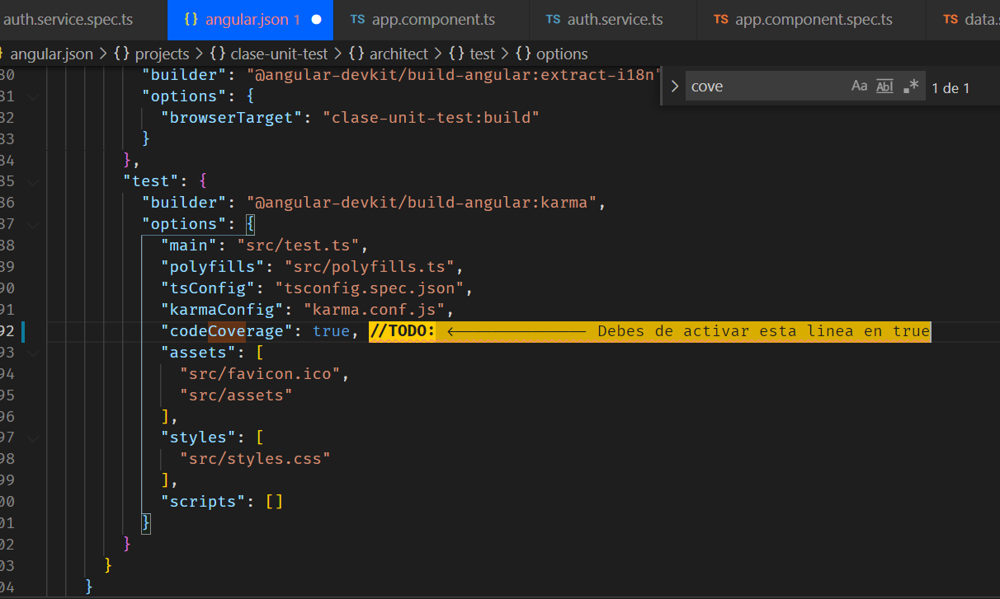

# Pruebas unitarias - Angular + Jasmine + Karma

En este taller, aprenderemos sobre pruebas unitarias en Angular utilizando dos herramientas esenciales: Jasmine y Karma. Las pruebas unitarias son una parte fundamental del desarrollo de software, ya que nos permiten garantizar que nuestras aplicaciones funcionen correctamente y continúen haciéndolo a medida que evolucionan.

## ¿Qué es Jasmine?

Jasmine es un marco de pruebas (framework) de JavaScript diseñado para facilitar la escritura y ejecución de pruebas unitarias en aplicaciones web. Aprenderemos a usar Jasmine para definir y ejecutar pruebas en Angular (No es exclusivo de Angular, lo puedes usar en cualquier aplicación web).

Algunas de sus características son:

- Sintaxis Declarativa: Jasmine utiliza una sintaxis declarativa que hace que las pruebas sean más legibles y comprensibles. Puedes utilizar declaraciones como describe, it, expect y funciones de comparación para definir tus pruebas. [Más información](https://codingpotions.com/angular-testing/)

- Spying: Jasmine proporciona la capacidad de espiar o simular llamadas a funciones o métodos, lo que es útil para verificar que ciertas funciones se han llamado con los argumentos correctos.

[Documentación oficial](https://jasmine.github.io/api/edge/Spy.html)
[Más información](https://www.digitalocean.com/community/tutorials/angular-testing-with-spies)

- Herramientas de Reporter: Jasmine incluye informes de resultados de pruebas que facilitan la identificación de pruebas que fallaron y la comprensión de los problemas.

## ¿Qué es Karma?

Es la herramienta desarrollada por el equipo de Angular que se encargara de ejecutar todas las pruebas escritas con Jasmine además te mostrara en un navegador el reporte de pruebas que pasaron exitosamente y las que retornaron un error.

## Configuraciones previas

Afortunadamente, al crear un proyecto con Angular , este se encarga de proporcionarnos toda la configuracion basica necesaria para comenzar a crear nuestras pruebas. Esta configuración incluye archivos de configuración como karma.conf.js y proporciona un entorno de prueba listo para su uso.

## Tipos de Pruebas Unitarias

En el contexto de Angular, existen varios tipos de pruebas unitarias que podemos realizar:

- Pruebas de Componentes: Estas pruebas se centran en las partes individuales de nuestra interfaz de usuario, es decir, en los componentes de Angular. Aseguraremos que los componentes se rendericen correctamente y funcionen según lo esperado.

- Pruebas de Servicios: Los servicios son una parte fundamental de la lógica de negocio de una aplicación Angular. Realizaremos pruebas para garantizar que los servicios se comporten adecuadamente.

- Pruebas de Pipes y Directivas: Los pipes y directivas son características importantes en Angular. Aprenderemos a probar su comportamiento y personalización.

- Pruebas de Rutas: Angular proporciona un enrutador para la navegación en la aplicación. Verificaremos que las rutas y la navegación funcionen correctamente.

## ¿Qué son los archivos .spec.ts?

Son los archivos que Angular va a cargar al momento de ejecutar el comando "ng test" estos archivos son los que contienen las pruebas.
Por cada componente o servicio que creemos con la ayuda de Angular CLI, se nos genera un archivo .spec.ts donde se espera que podamos trabajar las pruebas relacionadas a esa unidad.

## Buenas prácticas

- Aislamiento de Pruebas: Asegurarse de que cada prueba sea independiente y no afecte a otras pruebas.
  Mocking: Utilizar mocks para simular dependencias externas y controlar el comportamiento de las pruebas.

- Descriptores Significativos: Utilizar nombres de pruebas descriptivos para facilitar la comprensión de lo que se está probando.

- Pruebas Regresivas: Asegurarse de que las pruebas sigan funcionando a medida que se realiza el desarrollo y las actualizaciones de la aplicación.

## TestBed

Angular proporciona una herramienta llamada TestBed que nos permite configurar un módulo de prueba para nuestras pruebas unitarias. Simplifica la creación de instancias de componentes y servicios, y nos permite proporcionar sustitutos (mocks) de dependencias externas.

Crea un módulo de prueba (una clase @NgModule) que se configura con el método configureTestingModule para producir el entorno del módulo para la clase que desea probar. De hecho, separa el componente “a probar” de su propio módulo de aplicación y lo concecta a este módulo de prueba construcción dinámica.

[Documentación oficial](https://docs.angular.lat/guide/testing-services)

Un ejemplo simple de cómo se usa TestBed en una prueba unitaria podría verse así:

```js
import { TestBed, ComponentFixture } from "@angular/core/testing";
import { MiComponente } from "./mi-componente.component";

describe("MiComponente", () => {
  let fixture: ComponentFixture<MiComponente>;

  beforeEach(() => {
    TestBed.configureTestingModule({
      declarations: [MiComponente],
    });

    fixture = TestBed.createComponent(MiComponente);
  });

  it("debería crear el componente", () => {
    const componente = fixture.componentInstance;
    expect(componente).toBeTruthy();
  });
});
```

## Caso: Testear servicio que utiliza a HttpClient - Diferencia entre usar un "spy" de HttpClient y HttpClientTestingModule

La diferencia principal entre usar un "spy" de HttpClient y HttpClientTestingModule radica en cómo se abordan las solicitudes HTTP en las pruebas y su nivel de control.

### Spy de HttpClient:

- Con un "spy" de HttpClient, estás simulando el comportamiento de HttpClient. Puedes controlar y definir manualmente las respuestas simuladas que debe devolver. Esto te permite aislar las pruebas de la red y evitar llamadas reales al servidor.

- Puedes configurar los espías de métodos específicos de HttpClient, como get, post, put, delete, etc., para que devuelvan datos predefinidos o errores, lo que te permite probar diferentes casos sin necesidad de una red real.

- Puedes verificar explícitamente si se llamaron los métodos esperados con los argumentos correctos.

### HttpClientTestingModule:

- HttpClientTestingModule es un módulo de prueba proporcionado por Angular que configura un entorno simulado para las solicitudes HTTP. Se usa para realizar pruebas más "integradas" en las que se prueban las solicitudes y respuestas HTTP reales.

- Con HttpClientTestingModule, las solicitudes HTTP se envían al entorno simulado en lugar de la red real. Puedes especificar respuestas simuladas que el entorno de prueba debe devolver cuando se realicen solicitudes. Esto permite probar la integración entre tu código y HttpClient, incluida la lógica de manejo de respuestas.

- HttpClientTestingModule es útil cuando deseas probar cómo tu código interactúa con el cliente HTTP y cómo maneja las respuestas reales del servidor.

En resumen, si deseas realizar pruebas unitarias aisladas y evitar llamadas a la red real, los "spies" de HttpClient son una buena opción. Si deseas probar la interacción de tu código con HttpClient y cómo maneja las respuestas reales del servidor, HttpClientTestingModule es más adecuado. La elección depende de tus necesidades de prueba específicas y el nivel de control que desees tener sobre las solicitudes HTTP en tus pruebas.

## ¿Cómo activar reporte de cobertura?

Debes ubicar el archivo "angular.json" y luego buscar la propiedad "test" y agregar "codeCoverage:true" te dejo una imagen



## Más Información

- [Curso Testing desde Cero en Angular](https://www.youtube.com/playlist?list=PL_WGMLcL4jzVoCpd-QhvfM0v8lNUa8OSQ)
- [Test Unitarios con Jasmine y Karma](https://codigoencasa.com/pruebas-unitarias-en-angular/#:~:text=Jasmine%3A%20Es%20el%20framework%20encargado,%2C%20expect%22%20y%20muchas%20m%C3%A1s.)

## Angular 16

- [How to write test cases in angular 16 using Jasmine?](https://www.youtube.com/watch?v=J7YLuoGGQe0)
- [Unit Testing Angular 16](https://www.positronx.io/angular-unit-testing-application-with-jasmine-karma/)
- [Un vistazo a Jest para las pruebas de Angular en un futuro cercano](https://dev.to/this-is-angular/angular-testing-in-2023-past-present-and-future-j5m)

## Más ejemplos

- [Otro enfoque de Implementacion de tests en login](https://digital55.com/blog/como-usar-testing-angular-jasmine-karma/)
- [Ejemplos varios](https://medium.com/@vito1986/angular-unit-testing-8a1479079f84)
